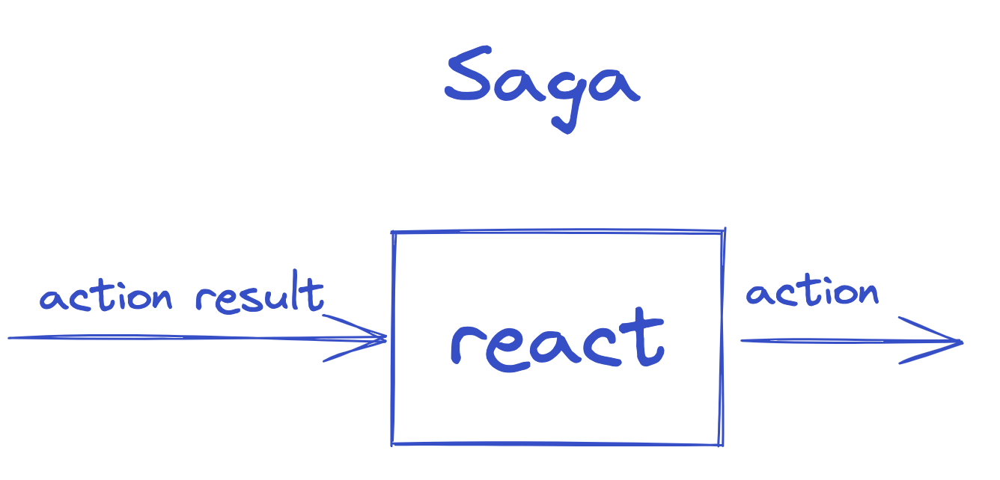

# **f`(`model-c#`)`** - Domain Modeling

> The project is in experimental phase. Pre-release packages are available at [nuget.org](https://www.nuget.org/packages/Fraktalio.FModel/).

> A stable release is one that's considered reliable enough to be used in production.

When you’re developing an information system to automate the activities of the business, you are modeling the business.
The abstractions that you design, the behaviors that you implement, and the UI interactions that you build all reflect
the business — together, they constitute the model of the domain.

## `IOR<Library, Inspiration>`

This project can be used as a multiplatform library, or as an inspiration, or both. **It provides just enough tactical
Domain-Driven Design patterns, optimised for Event Sourcing and CQRS.**


## Abstraction and generalization

Abstractions can hide irrelevant details and use names to reference objects. It emphasizes what an object is or does
rather than how it is represented or how it works.

Generalization reduces complexity by replacing multiple entities which perform similar functions with a single
construct.

Abstraction and generalization are often used together. Abstracts are generalized through parameterization to provide
more excellent utility.

## `Func<C, S, IEnumerable<E>> decide`

On a higher level of abstraction, any information system is responsible for handling the intent (`Command`) and based on
the current `State`, produce new facts (`Events`):

- given the current `State/S` *on the input*,
- when `Command/C` is handled *on the input*,
- expect list of new `Events/E` to be published/emitted *on the output*

## `Func<S, E, S> evolve`

The new state is always evolved out of the current state `S` and the current event `E`:

- given the current `State/S` *on the input*,
- when `Event/E` is handled *on the input*,
- expect new `State/S` to be published *on the output*

## Event-sourced or State-stored systems

- State-stored systems are traditional systems that are only storing the current State by overwriting the previous State
  in the storage.
- Event-sourced systems are storing the events in immutable storage by only appending.

Both types of systems can be designed by using only these two functions and three generic parameters:

- `Func<C, S, IEnumerable<E>> decide`
- `Func<S, E, S> evolve`


There is more to it! You can switch from one system type to another or have both flavors included within your systems
landscape.

Two functions are wrapped in a datatype class (algebraic data structure), which is generalized with three generic
parameters:

```cs
public class Decider<C, S, E>(Func<C, S, IEnumerable<E>> decide, Func<S, E, S> evolve)
{
    public Func<C, S, IEnumerable<E>> Decide { get; } = decide;
    public Func<S, E, S> Evolve { get; } = evolve;
}
```

`Decider` is the most important datatype, but it is not the only one. There are others:


## Decider

`Decider` is a datatype that represents the main decision-making algorithm. It belongs to the Domain layer. It has three
generic parameters `C`, `S`, `E` , representing the type of the values that `Decider` may contain or use.
`Decider` can be specialized for any type `C` or `S` or `E` because these types do not affect its
behavior. `Decider` behaves the same for `C`=`Int` or `C`=`YourCustomType`, for example.

`Decider` is a pure domain component.

- `C` - Command
- `S` - State
- `E` - Event

```cs
public class Decider<C, S, E>(Func<C, S, IEnumerable<E>> decide, Func<S, E, S> evolve, S initialState)
    : IDecider<C, S, E>
{
    public Func<C, S, IEnumerable<E>> Decide { get; } = decide;
    public Func<S, E, S> Evolve { get; } = evolve;
    public S InitialState { get; } = initialState;
}
```

Additionally, `initialState` of the Decider is introduced to gain more control over the initial state of the Decider.
Notice that `Decider` implements an interface `IDecider` to communicate the contract.


### Decider functions

#### Contravariant

- `Decider<Cn, S, E> MapLeftOnCommand<Cn>(Func<Cn, C> f)`

#### Profunctor (Contravariant and Covariant)

- `Decider<C, S, En> DimapOnEvent<En>(Func<En, E> fl, Func<E, En> fr)`
- `Decider<C, Sn, E> DimapOnState<Sn>(Func<Sn, S> fl, Func<S, Sn> fr)`

#### *Commutative* Monoid

```cs
public static Decider<C_SUPER?, Tuple<S, S2>, E_SUPER?> Combine<C, S, E, C2, S2, E2, C_SUPER, E_SUPER>(
        this Decider<C?, S, E?> x, Decider<C2?, S2, E2?> y)
        where C : class, C_SUPER
        where C2 : class, C_SUPER
        where E : class, E_SUPER
        where E2 : class, E_SUPER
```

> A monoid is a type together with a binary operation (`combine`) over that type, satisfying associativity and having an
> identity/empty element.
> Associativity facilitates parallelization by giving us the freedom to break problems into chunks that can be computed
> in parallel.
>
> `combine` operation is also commutative. This means that the order in which deciders are combined does not affect the
> result.


## View

`View`  is a datatype that represents the event handling algorithm, responsible for translating the events into
denormalized state, which is more adequate for querying. It belongs to the Domain layer. It is usually used to create
the view/query side of the CQRS pattern. Obviously, the command side of the CQRS is usually event-sourced aggregate/decider.

It has two generic parameters `S`, `E`, representing the type of the values that `View` may contain or use.
`View` can be specialized for any type of `S`, `E` because these types do not affect its behavior.
`View` behaves the same for `E`=`Int` or `E`=`YourCustomType`, for example.

`View` is a pure domain component.

- `S` - State
- `E` - Event

```cs
public class View<S, E>(Func<S, E, S> evolve, S initialState) : IView<S, E>
{
    public Func<S, E, S> Evolve { get; } = evolve;
    public S InitialState { get; } = initialState;
}
```

Notice that `View` implements an interface `IView` to communicate the contract.


### View functions

#### Contravariant

- `View<S, En> MapLeftOnEvent<En>(Func<En, E> f) => new InternalView<S, S, E>(Evolve, InitialState).MapLeftOnEvent(f).AsView();`

#### Profunctor (Contravariant and Covariant)

- `View<Sn, E> DimapOnState<Sn>(Func<Sn, S> fl, Func<S, Sn> fr) => new InternalView<S, S, E>(Evolve, InitialState).DimapOnState(fl, fr).AsView();`

#### *Commutative* Monoid

```cs
public static View<Tuple<S, S2>, E_SUPER> Combine<S, E, S2, E2, E_SUPER>(this View<S, E?> x, View<S2, E2?> y)
        where E : class, E_SUPER
        where E2 : class, E_SUPER
```

> A monoid is a type together with a binary operation (combine) over that type, satisfying associativity and having an
> identity/empty element.
> Associativity facilitates parallelization by giving us the freedom to break problems into chunks that can be computed
> in parallel.
>
> `combine` operation is also commutative. This means that the order in which views are combined does not affect the
> result.


## Saga

`Saga` is a datatype that represents the central point of control, deciding what to execute next (`A`). It is
responsible for mapping different events from many aggregates into action results `AR` that the `Saga` then can use to
calculate the next actions `A` to be mapped to commands of other aggregates.

`Saga` is stateless, it does not maintain the state.

It has two generic parameters `AR`, `A`, representing the type of the values that `Saga` may contain or use.
`Saga` can be specialized for any type of `AR`, `A` because these types do not affect its behavior.
`Saga` behaves the same for `AR`=`Int` or `AR`=`YourCustomType`, for example.

`Saga` is a pure domain component.

- `AR` - Action Result
- `A`  - Action

```cs
public class Saga<AR, A>(Func<AR, IEnumerable<A>> react) : ISaga<AR, A>
{
    public IEnumerable<A> React(AR actionResult) => react(actionResult);
}
```

Notice that `Saga` implements an interface `ISaga` to communicate the contract.




### Saga functions

#### Contravariant

- `Saga<ARn, A> MapLeftOnActionResult<ARn>(Func<ARn, AR> f) => new(arn => react(f(arn)));`

#### Covariant

- `Saga<AR, An> MapOnAction<An>(Func<A, An> f) => new(ar => react(ar).Select(f));`

#### Monoid

```cs
public static Saga<AR_SUPER, A_SUPER?> Combine<AR, A, AR2, A2, AR_SUPER, A_SUPER>(this Saga<AR?, A> sagaX,
        Saga<AR2?, A2> sagaY)
        where AR : AR_SUPER
        where A : A_SUPER
        where AR2 : AR_SUPER
        where A2 : A_SUPER
```

> A monoid is a type together with a binary operation (combine) over that type, satisfying associativity and having an
> identity/empty element.
> Associativity facilitates parallelization by giving us the freedom to break problems into chunks that can be computed
> in parallel.
>
> `combine` operation is also commutative. This means that the order in which sagas are combined does not affect the
> result.


## Getting Started with fmodel-c#
The fmodel-c# library is available on [nuget.org](https://www.nuget.org/packages/Fraktalio.FModel/).

### Note: fmodel-c# is in Pre-Release!
The `fmodel-c#` library is currently in pre-release. At this stage, it focuses exclusively on pure domain components that effectively model behavior.

The `application layer` will be included in future updates. This will provide guidance on composing and running the domain model in various scenarios, including:

- Event-sourced scenarios
- State-stored scenarios

### FModel in other languages

- [FModel in Kotlin](https://github.com/fraktalio/fmodel)
- [FModel in TypeScript](https://github.com/fraktalio/fmodel-ts)
- [FModel in Rust](https://github.com/fraktalio/fmodel-rust)

## References and further reading

- https://www.youtube.com/watch?v=kgYGMVDHQHs
- https://fraktalio.com/fmodel/

## Credits

Special credits to `Jérémie Chassaing` for sharing his [research](https://www.youtube.com/watch?v=kgYGMVDHQHs)
and `Adam Dymitruk` for hosting the meetup.

Thank you, [Srdjan Zivojinovic](https://github.com/zsrdjan) and [Crafters.cloud](https://www.crafters.cloud/), for your significant contributions to this project.

---
Created with :heart: by [Fraktalio](https://fraktalio.com/)